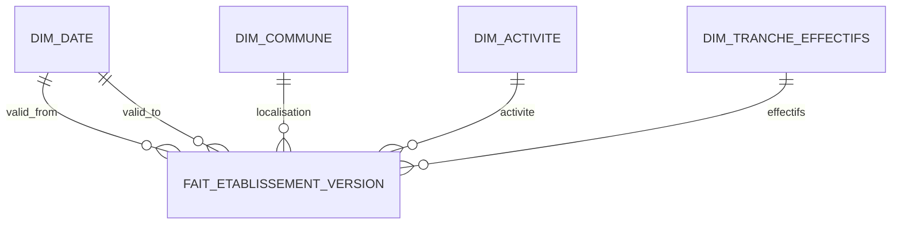
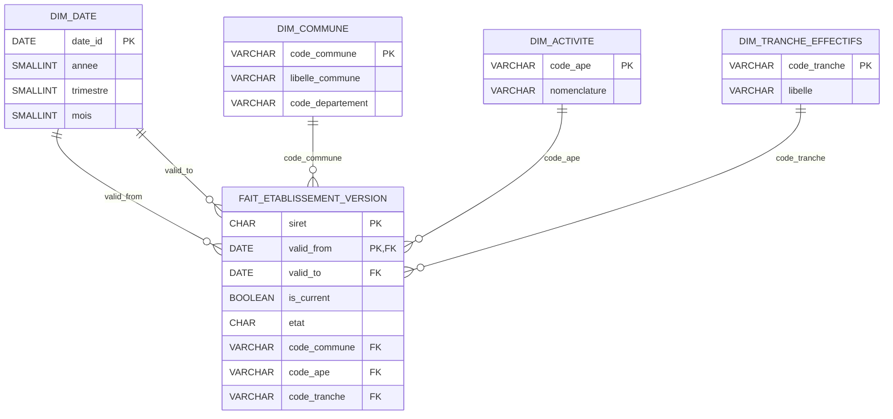
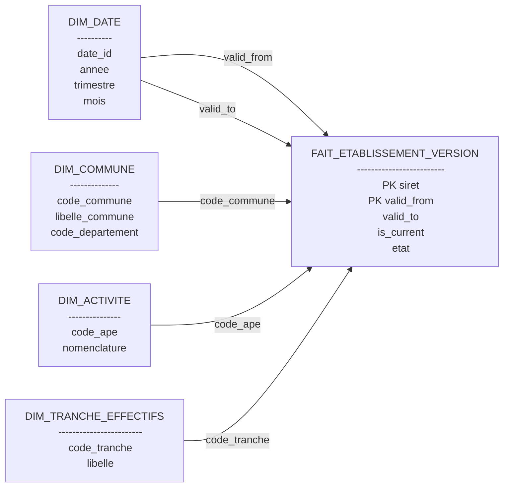

Oui. Ton schéma correspond à un **modèle en étoile (Star Schema)**. Le **MSD (Modèle Conceptuel / Schéma Décisionnel)** est volontairement simple, tandis que le **MLD (Modèle Logique de Données)** reprend les clés primaires, étrangères et les attributs.

---

# 1. MSD (Modèle Schéma Décisionnel)



C'est le schéma que l'on montre généralement au Product Manager ou au métier.

---

# 2. MLD (Modèle Logique de Données)



---

# 3. Vue "Étoile"

Pour le rapport, je recommande également ce diagramme Mermaid, plus visuel.



---

## Une petite amélioration

Ton modèle est **conforme au brief**, mais il est légèrement simplifié. Si tu souhaites le rendre plus proche d'un entrepôt décisionnel utilisé en entreprise, tu peux ajouter deux dimensions géographiques :

```text
dim_region
      │
      │
dim_departement
      │
      │
dim_commune
      │
      ▼
fait_etablissement_version
```

Ainsi :

* `dim_region` (Auvergne-Rhône-Alpes, Île-de-France…)
* `dim_departement` (Rhône, Ain, Loire…)
* `dim_commune` (Lyon, Villeurbanne…)

Le brief ne l'impose pas, mais c'est la modélisation que l'on retrouve le plus souvent dans les data warehouses professionnels. Tu peux la mentionner comme **évolution possible** dans `DECISIONS.md` tout en gardant le modèle conforme au contrat du PM.
